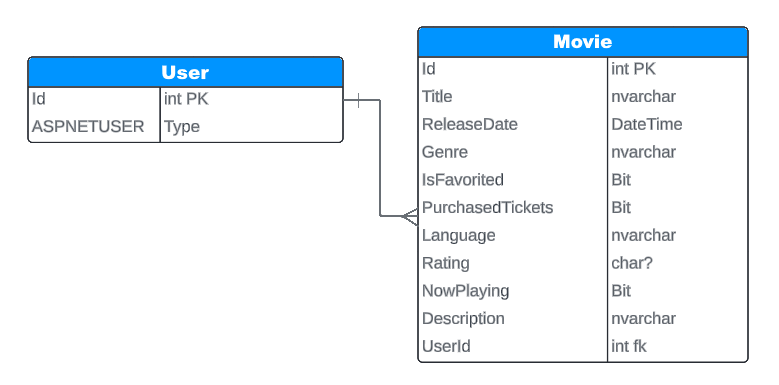

# Movie App Propoposal

## Overview

- This movie application leverages the Movie DB API to allow users to access to a vast database of movies, including current and upcoming releases.  This application will allow users to search for movies, view details, mark movies as favorites, and keep track of movies they've watched.

## MVP Features

- Implement User Registration / Login / Logout
- User able to search current or upcoming movies by genre / language / title
- User should be able to get a link to reserve movie tickets
- Implement the user being able to have a list of favorite movies
- Add a feature which indicates if a user has watch a movie in the past
- Add a feature which indicates if a user has bought tickets for a movie

## Stretch Goals

- Implement SonarQloud
- Add a Friends List

## External API

- [The MovieDB API - Getting started](https://developer.themoviedb.org/reference/intro/getting-started)
- [The MovieDB API - Upcoming movies](https://developer.themoviedb.org/reference/movie-upcoming-list)

## ERD

[Lucid chart of ERD](https://lucid.app/lucidchart/cd5040eb-388e-47f5-9d0e-6f058d5414e4/edit?view_items=tSIAFGnDPSlT&invitationId=inv_018cbaa0-cd31-415c-8c03-4833790897fb)

## Project group standards

- Github
    - Main Branch Protection
        - Pull Requests need 2 approvals
- Coding convention
    - camelCase vars
    - underscore interfaces
    - namespaces
        - server.* / client.*
- Communication standard
    - discord server
    - Scrum meetings
        - every weekday
    - Scrum Lead
        - Evan
- Code structure
    - 2 repos server/client
    - Server
        - Models
        - Services (Models services, http calls)
        - Controllers
        - Data (Context/Repositories)
        - DTO (register,login)

    - Client
        - components
        - pages
        - types

## Requirements
- Application Must build and run
- Unit Testing (70% code coverage for Services and Models layer)
- Both ends hosted on Azure Cloud Services
- CI/CD Pipeline 
- Containerized backend

## Project Members

- Fatima Jillani
- Evan Wilcher
- Kenan McKenzie
- Ulada Haranina
- Nakiyyah Price
- Michael Phan
- Virgilio Cabading